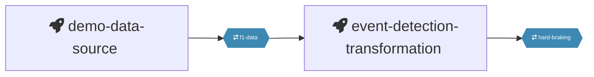

```mermaid
%%{ init: { 'flowchart': { 'curve': 'monotoneX' } } }%%
graph LR;
demo-data-source[fa:fa-rocket demo-data-source &#8205] --> f1-data{{ fa:fa-arrow-right-arrow-left f1-data &#8205}}:::topic;
f1-data{{ fa:fa-arrow-right-arrow-left f1-data &#8205}}:::topic --> event-detection-transformation[fa:fa-rocket event-detection-transformation &#8205];
event-detection-transformation[fa:fa-rocket event-detection-transformation &#8205] --> hard-braking{{ fa:fa-arrow-right-arrow-left hard-braking &#8205}}:::topic;


classDef default font-size:110%;
classDef topic font-size:80%;
classDef topic fill:#3E89B3;
classDef topic stroke:#3E89B3;
classDef topic color:white;
```